# Concept guide

## Why ΔSCII?

The [asciinema](https://asciinema.org/) [asciicast](https://github.com/asciinema/asciinema/blob/main/doc/asciicast-v2.md) format includes an event timestamp for each event, represented in seconds since the beginning of the recording.
For example, if you want to edit specific event timestamps to correct typos or adjust typing speed, it's not practical to edit all subsequent event timestamps.

ΔSCII represents the duration between each event rather than the timestamp, making it easier to edit asciicast files.

## See also

- [How-to guide](./how-to-guide.md)
